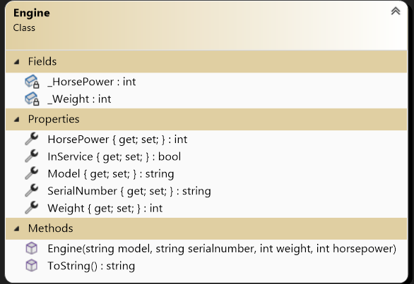

# OOP Training

> This is the first of a set of exercises that follow the evolution of a program to manage trains. This set is cumulative and will build upon previous exercises.

## Objectives

This exercise will allow you to demonstrate:

- your ability to read and interpret a class diagram
- coded class based on a class diagram and set of specifications
- implement validation within a class given a set of specifications
- use unit testing to vertify the coded class is valid
- use of a common set of methods for validation

## Overview

Your task is to generate a set of simple data types to represent the primary objects for managing trains. 

For this exercise, place all the required data types in the namespace `TrainSystem` and ensure that the classes are `public`. Create your project as a Class Library (.NET Core 7). Each class will represent an item (Engine, RailCar (**Exercise 2**), or Train (**Exercise 2**)). Certain characteristics of each item are set and cannot be altered. You will need to read the specifications carefully to determine the access levels for item characteristics. You will need to use the supplied unit tests for this exercise to demonstrate your objects can hold appropriate data.

### General Validation Rules

All validation is to be performed by throwing exceptions. Here are some general requirements.

- Exceptions must have meaningful error messages and be of an appropriate type
  - missing value in parameter: ArgumentNullException
  - incorrect value for parameter: ArgumentException, ArgumentOutOfRangeException, or FormatException
  - incorrect operation due to dependent value: InvalidOperationException
- Error messages must include details about the limits for acceptable values.
- Weights must always be positive and non-zero whole numbers. Weights are to be in 100 pound increments (all weights are in pounds). Example 1200 is good, 1210 is bad.
- All string information must contain text. Null, empty, and plain white-space text is not allowed. Sanitize your strings by trimming the leading and trailing whitespace.
- All **public** level mutators must have necessary validation within the properties.

### The `Engine`

Engines are the workhorse of the railway system. For our purposes, we need to track the train engine's **Model** (e.g.: "CP 8002"), **Serial Number** (e.g.: "B48807"), **InService** (e.g.: True), **Weight** (in pounds, e.g.: 147,700), and **Horse Power** (e.g.: 4400). The Model and Serial Number must be stored as read-only information (it cannot be modified by an outside user or changed once the instance has been created). Weight and Horse Power will change as upgrades are done to the engine throughout its lifetime. Allow direct upgrades to these characteristics. Weight and Horse Power can only be altered if the engine is not in service. You will need a greedy constructor for this class. The engine is defaulted to inservice when created. Create an overloaded .ToString() method for the class to return the instance values in a comma separated value string: Model,SerialNumber,Weight,Power,InService.

Note the following:

- Horse Power must be a positive whole number between 3500 and 5500. HP is measured in 100 HP increments.

----
### The `Utilities`

Create a public static class called `Utilities`. This class will have public static methods which can be used to do common testing.

1. Create a method that will validate a numeric value to be a non-zero positive. 
1. Create a method that will validate a numeric value is in 100 unit increments.

**You must use these methods within your Engine classes where appropriate.**

### The `Unit Tests`

A unit testing project called `UnitTestingEx1` has been supplied for this exercise. Add it to your solution. The tests have been commented out. As you code items in your class you can uncomment the appropriate unit test to evaluate your code. There is a separate unit test class for each of your classes. Check the unit test for the type of exception that is expected.

## Submission

Commit your work in your **exercise** repository and sync to github.com.

## Evaluation

> ***NOTE:** Your code **must** compile. Solutions that do not compile will receive an automatic mark of zero (0).*
> 
> If you are unable to get a portion of the assignment to compile, you should:
> - Comment out the non-compiling portion of code
> - Identify the non-compiling portion with a **Incomplete Requirements** heading, noting the item's
>  

## Marking Rubric

| Weight | Description |
| ----   | --------- |
| **5** | Excellent - no improvement to recommend |  
| **4** | Very Good - work meets requirements; passes all unit test cases but there are some improvements to the code that is recommended |  
| **3** | Acceptable - coded all the requirements but some unit test cases are not passing because there are minor logical errors in the code; there are some improvements to the code that is recommended |  
| **2** | Needs Work - coded most of the requirements; code is structured correctly; failure of unit test cases; there are major logical errors in the code |   
| **1** | Unsatisfactory - coded some of the requirements; code has syntax errors; failure of unit test cases and/or unit test not used; there are major logic errors |   
| **0** | Not done; compile errors; large component of requirements are missing; work submitted not of the requested software version; work submitted not using the requests templates (such as but not limited to: .Net Core 7, not a class library, not using supplied unit tests) |  
| ----   | --------- | 
| TBA  | Marks Earned |  
----

----

## Credits

- [Engine Image](./CP-7002-TStevens.jpg) - [Source](https://www.thedieselshop.us/CP.HTML)

[Back to Exercise selection](../README.md)
